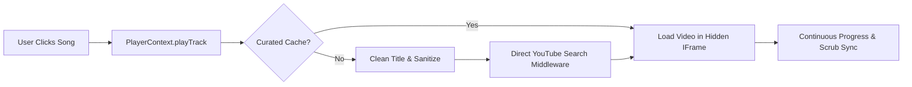

# 🎵 Spotify Web Player Clone (Hybrid Audio Engine)

A pixel-perfect, feature-complete clone of the official **[Spotify Web Player](https://open.spotify.com)** built with **React**, **TypeScript**, **Tailwind CSS v4**, and **Vite**. 

It pairs authentic Spotify UI and metadata with an intelligent background **YouTube Audio Streaming Engine** — allowing full-length music playback without requiring a Spotify Premium subscription.

---

## ✨ Features

### 🎧 Audio Playback & Hybrid Engine
- **Full-Length Song Playback**: Streams audio seamlessly in the background via a hidden YouTube IFrame player.
- **Smart Stream Resolver**:
  - Direct local search middleware (`/api/yt-search`) for instantaneous, CORS-free resolution.
  - Automatic title cleaning to strip noisy soundtrack tags like `(From "Jawan")` or `(Original Motion Picture Soundtrack)`.
  - Built-in curated instant-lookup cache for top trending & Bollywood/Pop hits (sub-millisecond start).
  - Resilient fallback to decentralized Piped API endpoints.
- **Interactive Player Bar**:
  - Interactive scrub slider with smooth drag-to-seek, hover time tooltips, and real-time progress syncing.
  - Volume slider with mute/unmute toggling.
  - Play, pause, previous track, next track, shuffle, and repeat toggles.

### 🎨 Spotify-Authentic Interface
- **Official Spotify Dark Theme**: Pixel-perfect layout with `#121212` backgrounds, card hover lift animations, and Spotify green accents (`#1ed760`).
- **Artist Page (`open.spotify.com/artist/...`)**:
  - Verified Artist badge, monthly listener statistics, and glowing play button.
  - Popular tracks table with stream counters and expand/collapse controls (top 5 to top 10).
  - Discography tabs: Popular releases, Albums, Singles and EPs.
  - "Fans Also Like" related artists section.
- **Album View**: Full tracklist table with duration, track numbering, play-on-hover, like button, and playlist menu.
- **Now Playing View (Right Sidebar)**: Slide-out drawer displaying high-resolution cover artwork, artist information, credits, and queue preview.
- **Queue Drawer**: Dedicated list of upcoming songs with animated sound wave equalizer.
- **Karaoke Lyrics**: Full-screen synced lyrics modal powered by LRCLib.

### 📚 Library & State Management
- **State-Preserving Navigation**: Switch seamlessly between Home, Search, Artist, Album, and Playlist views without losing your search query or scrolling position.
- **Liked Songs**: Dedicated playlist with heart button toggles persisted in `localStorage`.
- **Custom Playlists**: Create, rename, delete custom playlists, and add any track directly via the "Add to Playlist" modal.

---

## 🛠️ Tech Stack

| Technology | Purpose |
|---|---|
| **React 19** | Core UI library with modern hooks and state management |
| **TypeScript** | Type safety across Spotify APIs, models, and audio states |
| **Vite** | Fast HMR dev server and optimized production bundler |
| **Tailwind CSS v4** | Modern utility-first styling matching Spotify's exact design system |
| **Lucide React** | Clean, minimalist Spotify-styled iconography |
| **YouTube IFrame API** | Background high-fidelity audio engine |
| **Spotify Web API & iTunes Search** | Dual-source rich music metadata resolution |
| **LRCLib** | Synchronized lyrics provider |

---

## 🚀 Getting Started

### Prerequisites
- **Node.js**: v18.0 or higher
- **npm** or **yarn** / **pnpm**

### 1. Clone the Repository
```bash
git clone git@github.com:tusharnangare31/spotify-clone.git
cd spotify-clone
```

### 2. Install Dependencies
```bash
npm install
```

### 3. Configure Environment Variables (Optional)
The application works out-of-the-box using built-in iTunes fallback search and curated metadata. To connect directly to Spotify's official API:

Create a `.env` file in the root directory:
```env
VITE_SPOTIFY_CLIENT_ID=your_spotify_client_id
VITE_SPOTIFY_CLIENT_SECRET=your_spotify_client_secret
```
> *You can obtain credentials from the [Spotify Developer Dashboard](https://developer.spotify.com/dashboard).*

### 4. Start the Development Server
```bash
npm run dev
```
Open [http://localhost:5173](http://localhost:5173) in your browser.

---

## 📦 Project Structure

```text
spotify-clone/
├── public/                 # Static assets
├── src/
│   ├── components/         # Spotify UI components
│   │   ├── AlbumView.tsx             # Album page with full tracklist
│   │   ├── ArtistView.tsx            # Authentic artist page (Verified badge, discography)
│   │   ├── HomeView.tsx              # Spotify home page feed
│   │   ├── LikedSongsView.tsx        # Saved tracks playlist
│   │   ├── LyricsModal.tsx           # Full-screen synced lyrics
│   │   ├── NowPlayingRightSidebar.tsx# Right-hand track details panel
│   │   ├── PlayerBar.tsx             # Bottom playback control bar
│   │   ├── PlaylistModal.tsx         # Create new playlist modal
│   │   ├── PlaylistView.tsx          # Custom playlist view
│   │   ├── QueueDrawer.tsx           # Upcoming tracks queue drawer
│   │   ├── SearchView.tsx            # Search input & browse categories
│   │   └── Sidebar.tsx               # Left navigation & library drawer
│   ├── context/
│   │   └── PlayerContext.tsx         # Global audio state & YouTube IFrame engine
│   ├── services/
│   │   ├── spotify.ts                # Spotify + iTunes fallback metadata client
│   │   ├── storage.ts                # LocalStorage management for playlists & likes
│   │   └── youtubeResolver.ts        # Multi-tiered YouTube audio stream resolver
│   ├── types/
│   │   └── spotify.ts                # TypeScript interfaces for Spotify entities
│   ├── App.tsx                       # Root view orchestrator with tab state preservation
│   ├── index.css                     # Tailwind CSS imports & custom styling
│   └── main.tsx                      # App entry point
├── index.html
├── package.json
├── tsconfig.json
└── vite.config.ts                    # Vite config with YouTube search middleware
```

---

## 📜 How the Audio Engine Works



1. **Track Request**: When a song is selected, `PlayerContext` receives the metadata.
2. **Title Sanitization**: Removes parenthetical movie soundtrack info and features so search engines match the exact track.
3. **Stream Resolution**: Directly scrapes and caches the matching YouTube video ID via local Node middleware or fallback APIs.
4. **Playback**: Loads the video into an invisible, low-resource YouTube Iframe player that pipes audio continuously.

---

## 🤝 Contributing

Contributions, issues, and feature requests are welcome! Feel free to check the [issues page](https://github.com/tusharnangare31/spotify-clone/issues).

---

## 📄 License

This project is licensed under the [MIT License](LICENSE).

